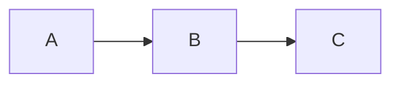

# Draw diagrams in markdown

This gridsome plugin allows you to draw diagrams using markdown. 

Once installed, we can embed `mermaid` code blocks in our markdown to generate diagrams.

~~~
mermaid
graph LR
  A --> B
  B --> C
~~~



- See [mermaid](https://mermaid-js.github.io) for more examples.

- Try out the [mermaid editor](https://mermaid-js.github.io/mermaid-live-editor/).

## Install

Follow the generic instructions for gridsome first.

```
bash
npm install gridsome-plugin-remark-diagrams
```

## Usage

Configure `gridsome.config.js` to use the plugin.

```
  transformers: {
    remark: {
      plugins: [
        'gridsome-plugin-remark-diagrams',
        // existing plugins //
      ]
    }
  }
```


## Advanced Styling

The generated SVG is wrapped in `<div class="mermaid"></div>` to help you customize your styles.

When using the `removeStyleTags` attribute, you will need to import your Mermaid themes yourself. 


## Options

| Name            | Default               | Description                                                                                                                                                     |
| --------------- | --------------------- | --------------------------------------------------------------------------------------------------------------------------------------------------------------- |
| language        | "mermaid"             | The code block tag.                                                 |
| theme           | "default"             | `"dark"`|`"neutral"`|`"forest"`|`"default"` |
| viewport.width  | 200                   | width of image                                                                                                                                      |
| viewport.height | 200                   | height of image                                                                                                                                     |
| removeStyleTags | false                 | Remove all style tags from the generated SVG. If you use this option you will have to import the mermaid css at some point                                      |
| id              | `mermaid-<currentTime>` | Sets the identifier of the SVG. Defaults to a unique ID based on the time of generation                                                                         |
| mermaidOptions  | {}                    | use custom [mermaid configuration options](https://mermaid-js.github.io/mermaid/#/mermaidAPI?id=configuration) to `mermaid.initialize()`                                                                                    |

The default options are:

```js
{
  language: "mermaid",
  theme: "default",
  viewport: {
    width: 200,
    height: 200
  },
  id: null,
  removeStyleTags: false,
  mermaidOptions: {}
}
```

## Provenance / Credits

This plugin was forked, upgraded and adopted with gratitude to the original authors.

You can find the original versions here: 

- Forked and upgraded from [gridsome-remark-mermaid](https://github.com/Braincoke/gridsome-plugin-remark-mermaid)
- Originally inspired by [gatsby-remark-mermaid](https://github.com/ChappIO/gatsby-remark-mermaid)
